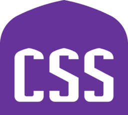

# Proposal for new CSS logo design

## Intro

I came to the web late and had no computer science background,
but car repair, construction, and furniture manufacturing.

With terms like V8, Framework, Style etc. in mind, i felt confident that the adventure would be simple.

Just like in construction, furniture has its own styles. The
best style is Gothic! Beautiful, magical, majestic, a little
scary, pure and bright Gothic! Its impact has been tested for
centuries. Beauty is so divine that it was deliberately
denigrated, thus hidden from general understanding.

The beauty of this approach lies in its simplicity and conciseness. By employing proportions, straight lines, and circular arcs, it provides remarkable structural strength with minimal materials—something any web application would wish to replicate.

One of the pearls of Gothic is the four-centred arch. The Tudor
arch.

Cambridge, Princeton, Hampton Court Palace, Windsor Castle and of course Taj Mahal... Gothic is scattered all over the world.

Please, let gothic be here, on the web, for 5 minutes... Then...
Then you will not be able to forget it. With organ music, 3
minutes will be enough...😀

So, we have stylish cars, stylish architecture/furniture, but no stylish
CSS! Paradox!

## How is it done?

The main detail in the proposed version is a 4-center arch. It is built according to a certain algorithm. Variations are possible, but the principle is 4 arcs of a circle, paired equal. Built in Sketchup 2019. File <ins>Tudor_arch.skp</ins> attached. Here's a snapshot to give you a fast visual.

I've written a script to create an SVG based on the drawing's dimensions. To build we only need one dimension. This is the length of the baseline or Span Line (512 in this case). Although for rendering on the HTML page i chose the size 256 as the maximum. All the magic numbers in the script are based on this baseline size, as well as my subjective vision of proportions. Ancient architectural sages understood a profound truth: harmony emerges not from complexity, but from the perfect balance of proportions.

I understood that the smaller the size of the letters (in the case of lower resolutions), the simpler the outline should be. Another piece of wisdom from the past: the measure of everything is man. But I couldn't resist and added the same style to the letters. Though i aligned the letters horizontally in the center to improve perception. Let's break down the design together - check out the dimensions, proportions, and color palette!

We could potentially have different logo variations for various devices and utilize a color version for holidays, which is something we've accomplished already. Come on, people, everyone to the CSS party! Let's make
the web right now!

### Footer

Your feedback on the codebase is welcomed. Please share any comments, corrections, suggestions, or errors you find!
